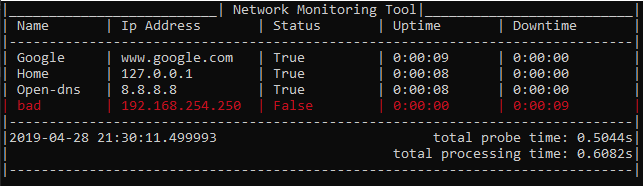

## Netmon
---

1. Monitor network IP Uptime / Downtine
2. Uses multiple thread

#### How to Use

1. go to netmon/netmon folder
2. make sure to install requirements.txt
3. edit ipaddress.txt
    example: home, 127.0.0.1
4. run
    python netmon.py

#### Screenshot

